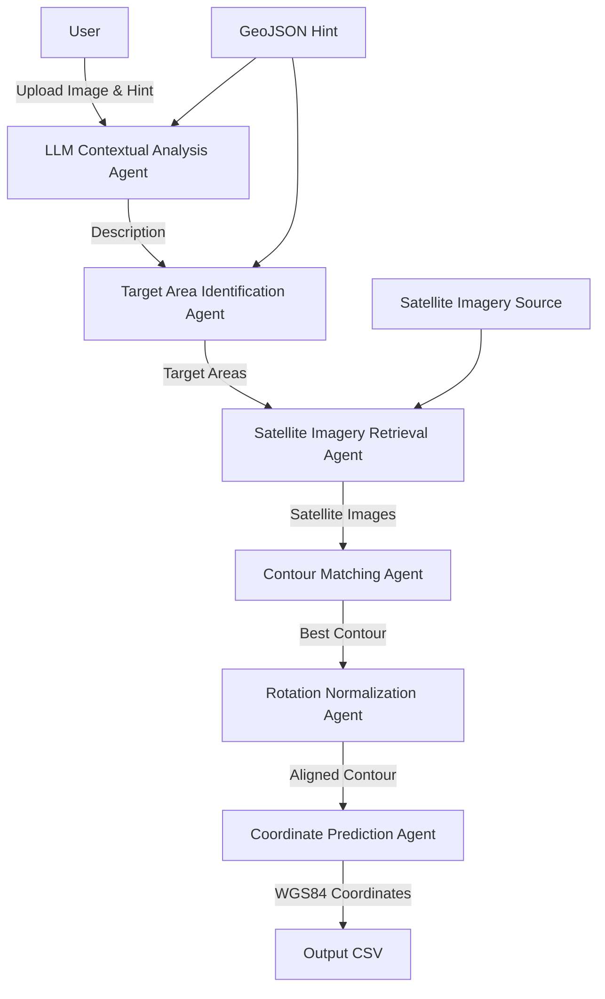

# Multi-Agent System Outline for Drone Relocalisation with JSON Schemas

This document updates the multi-agent system design for the drone relocalisation challenge in a GPS-denied environment, incorporating expected input and output JSON schemas for each component to enhance collaboration. The system uses a vision-capable LLM, geospatial queries, and contour-based matching to predict WGS84 coordinates from drone images and geojson hints. A Mermaid diagram illustrates the system architecture, and each component is detailed as a Jira-like ticket with objectives, requirements, sources, approaches, issues, testing criteria, agent journey, and JSON schemas.

## Problem Overview
In contested environments, GPS is unreliable, requiring alternative navigation methods. The challenge involves predicting a drone’s WGS84 coordinates using aerial images, with rough geojson hint areas to reduce search space. The provided repository ([25-LDTH-Relocalisation](https://github.com/arondite-public/25-LDTH-Relocalisation)) offers utilities for accessing satellite imagery (Copernicus VHR Image Mosaic, 2m resolution). Evaluation is based on the error between predicted and true coordinates. The solution leverages LLM contextual analysis and contour matching, optimized for urban/suburban areas with distinct features like parks or cul-de-sacs.

## Solution Overview
The multi-agent system processes a drone image and optional geojson hint through six components:
1. **LLM Contextual Analysis**: Describes the scene (e.g., “near a park, cul-de-sac”) using a vision-capable LLM.
2. **Target Area Identification**: Maps descriptions to geographic areas via OpenStreetMap (OSM) queries.
3. **Satellite Imagery Retrieval**: Fetches satellite imagery for target areas.
4. **Contour Matching**: Matches contours between drone and satellite images using OpenCV.
5. **Rotation Normalization**: Aligns contours by normalizing rotation.
6. **Coordinate Prediction**: Computes WGS84 coordinates from the best match.

The system is inspired by AlphaGeometry’s hybrid approach ([AlphaGeometry](https://deepmind.google/discover/blog/alphageometry-an-olympiad-level-ai-system-for-geometry/)), combining intuitive reasoning (LLM) with precise geometric matching (contours). It is implemented in Python, using OpenCV, GeoPandas, and the xAI Grok 3 API.

## System Architecture
The Mermaid diagram below illustrates the data flow between components, highlighting inputs (e.g., drone image, geojson hint) and outputs (e.g., coordinates).



**Diagram Explanation**:
- The user uploads a drone image and optional geojson hint.
- The LLM Contextual Analysis Agent processes the image to produce a description.
- The Target Area Identification Agent uses the description and hint to identify target areas.
- The Satellite Imagery Retrieval Agent fetches imagery for these areas.
- The Contour Matching Agent matches contours, followed by rotation normalization.
- The Coordinate Prediction Agent computes final coordinates, output as a CSV.

## Components
Below are the six components, each detailed as a Jira-like ticket with input and output JSON schemas.

### Component 1: LLM Contextual Analysis Agent
- **Objectives**: Generate a textual description of the drone image’s scene to identify landmarks (e.g., parks, cul-de-sacs).
- **Key Requirements**:
  - Process drone images via a vision-capable LLM.
  - Generate accurate, concise descriptions of landmarks.
  - Handle varying image qualities and urban/suburban scenes.
- **Sources / Documents**:
  - xAI API for Grok 3 vision mode ([xAI API](https://x.ai/api)).
  - OpenAI GPT-4o as a fallback ([OpenAI API](https://platform.openai.com/docs/api-reference)).
- **Suggested Approaches**:
  - Encode image as base64 and send to xAI Grok 3 API with prompt: “Describe the scene, focusing on landmarks like parks or cul-de-sacs.”
  - Parse response to extract keywords using regex or NLP.
- **Possible Issues**:
  - Inaccurate descriptions due to image noise.
  - API quota limits or access issues.
  - Verbose or irrelevant descriptions.
- **Testing Criteria**:
  - Correct landmark identification in >80% of test images.
  - Descriptions are concise and relevant.
  - Response time <5 seconds per image.
- **Agent Journey**:
  1. Receive drone image path and optional hint.
  2. Encode image as base64.
  3. Query xAI Grok 3 API.
  4. Parse response for landmarks.
  5. Output description to Target Area Identification Agent.
- **Expected Input JSON**:
  ```json
  {
    "image_path": "string", // Path to drone image (e.g., "data/images/test_image.jpg")
    "hint_path": "string" // Optional path to geojson hint (e.g., "data/geojson_hints/hint.json")
  }
  ```
- **Expected Output JSON**:
  ```json
  {
    "image_id": "string", // Unique identifier for image (e.g., "test_image_001")
    "description": "string", // Scene description (e.g., "Suburban area near a park and a cul-de-sac")
    "keywords": ["string"] // Extracted landmarks (e.g., ["park", "cul-de-sac", "suburban"])
  }
  ```

**Component Guide/Cookbook**:
- **Setup**: Obtain xAI API key; install `requests`.
- **Implementation**: Encode images with `base64`; send JSON payload.
- **Debugging**: Log API responses; refine prompt for accuracy.

**Alternatives to Explore**:
- Use GPT-4o for vision tasks.
- Implement local CNN (e.g., YOLO) for landmark detection.
- Enhance images (e.g., contrast adjustment) before LLM processing.

---

### Component 2: Target Area Identification Agent
- **Objectives**: Map LLM descriptions to geographic areas within the hint using OSM queries.
- **Key Requirements**:
  - Identify features like parks or cul-de-sacs.
  - Return a list of target area geometries.
  - Minimize false positives.
- **Sources / Documents**:
  - OpenStreetMap Overpass API ([Overpass API](https://wiki.openstreetmap.org/wiki/Overpass_API)).
  - GeoPandas ([GeoPandas](https://geopandas.org/)).
  - Overpy ([Overpy](https://github.com/DinoTools/python-overpy)).
- **Suggested Approaches**:
  - Parse LLM keywords (e.g., “park” → `leisure=park`).
  - Query OSM via Overpass API within hint bounds.
  - Buffer features (e.g., 100m) to create target areas.
- **Possible Issues**:
  - Incomplete OSM data for features.
  - Overlapping target areas.
  - Slow queries for large areas.
- **Testing Criteria**:
  - >90% of areas contain the described feature.
  - <5 target areas per image.
  - Query time <2 seconds.
- **Agent Journey**:
  1. Receive LLM description and hint geojson.
  2. Parse keywords for OSM tags.
  3. Query Overpass API.
  4. Buffer results to create target areas.
  5. Output areas to Satellite Imagery Retrieval Agent.
- **Expected Input JSON**:
  ```json
  {
    "image_id": "string", // Image identifier (e.g., "test_image_001")
    "description": "string", // LLM description (e.g., "Suburban area near a park and a cul-de-sac")
    "keywords": ["string"], // Landmarks (e.g., ["park", "cul-de-sac", "suburban"])
    "hint_path": "string" // Path to geojson hint (e.g., "data/geojson_hints/hint.json")
  }
  ```
- **Expected Output JSON**:
  ```json
  {
    "image_id": "string", // Image identifier (e.g., "test_image_001")
    "target_areas": [
      {
        "id": "string", // Area identifier (e.g., "area_001")
        "geometry": {
          "type": "Polygon",
          "coordinates": [[[number, number]]]
        },
        "feature_type": "string" // Feature type (e.g., "park")
      }
    ]
  }
  ```

**Component Guide/Cookbook**:
- **Setup**: Install `overpy`, `geopandas`; test Overpass API.
- **Implementation**: Build dynamic Overpass QL queries.
- **Debugging**: Visualize areas with GeoPandas; log query results.

**Alternatives to Explore**:
- Google Places API for landmarks.
- Manual feature tagging for small datasets.
- Local OSM cache for faster queries.

---

### Component 3: Satellite Imagery Retrieval Agent
- **Objectives**: Fetch satellite imagery for target areas.
- **Key Requirements**:
  - Retrieve high-resolution imagery (e.g., Copernicus VHR).
  - Handle multiple areas efficiently.
  - Align imagery with coordinates.
- **Sources / Documents**:
  - Repository utility `get_satellite_image.py` ([25-LDTH-Relocalisation](https://github.com/arondite-public/25-LDTH-Relocalisation)).
  - Google Earth Engine ([GEE](https://earthengine.google.com/)).
  - Copernicus VHR Image Mosaic ([Copernicus VHR](https://land.copernicus.eu/en/products/european-image-mosaic/very-high-resolution-image-mosaic-2021-true-colour-2m)).
- **Suggested Approaches**:
  - Use `get_satellite_image.py` to fetch imagery for target area bounds.
  - Cache images locally to avoid repeated queries.
  - Alternatively, use GEE for Sentinel-2 imagery.
- **Possible Issues**:
  - Limited access to Copernicus VHR data.
  - Misaligned imagery due to coordinate mismatches.
  - Large image sizes slowing processing.
- **Testing Criteria**:
  - Successful retrieval for >95% of target areas.
  - Imagery bounds match target area coordinates.
  - Retrieval time <10 seconds per area.
- **Agent Journey**:
  1. Receive target areas from Target Area Identification Agent.
  2. Extract bounds for each area.
  3. Query satellite imagery using `get_satellite_image.py`.
  4. Store images in `data/satellite_imagery/`.
  5. Output image paths and bounds to Contour Matching Agent.
- **Expected Input JSON**:
  ```json
  {
    "image_id": "string", // Image identifier (e.g., "test_image_001")
    "target_areas": [
      {
        "id": "string", // Area identifier (e.g., "area_001")
        "geometry": {
          "type": "Polygon",
          "coordinates": [[[number, number]]]
        },
        "feature_type": "string" // Feature type (e.g., "park")
      }
    ]
  }
  ```
- **Expected Output JSON**:
  ```json
  {
    "image_id": "string", // Image identifier (e.g., "test_image_001")
    "satellite_images": [
      {
        "area_id": "string", // Area identifier (e.g., "area_001")
        "image_path": "string", // Path to satellite image (e.g., "data/satellite_imagery/area_001.jpg")
        "bounds": [number, number, number, number] // [minx, miny, maxx, maxy]
      }
    ]
  }
  ```

**Component Guide/Cookbook**:
- **Setup**: Configure repository utility; test GEE authentication if used.
- **Implementation**: Loop through target areas, calling utility for each.
- **Debugging**: Verify image bounds; check for null responses.

**Alternatives to Explore**:
- Sentinel Hub API for imagery.
- Pre-download imagery for hint areas.
- Fallback to lower-resolution imagery.

---

### Component 4: Contour Matching Agent
- **Objectives**: Extract and match contours between drone and satellite تصریح

System: images to identify the best candidate area.
- **Key Requirements**:
  - Accurately extract contours from both images.
  - Match contours with high precision, minimizing false positives.
  - Handle scale and rotation differences.
- **Sources / Documents**:
  - OpenCV contour detection ([OpenCV Contours](https://docs.opencv.org/4.x/d4/d73/tutorial_py_contours_begin.html)).
  - Contour-based registration research ([Contour-based multisensor image registration](https://www.researchgate.net/publication/224297664_Contour-based_multisensor_image_registration_with_rigid_transformation)).
- **Suggested Approaches**:
  - Preprocess images with Canny edge detection.
  - Extract contours using `cv2.findContours`, filtering by length (>150 pixels).
  - Match contours using `cv2.matchShapes` with Hu moments.
  - Test multiple scales (e.g., 0.5x–2x) to handle scale differences.
- **Possible Issues**:
  - Scale mismatches reducing match accuracy.
  - Noisy contours due to low image contrast.
  - High computational cost for multiple areas.
- **Agent Journey**:
  1. Receive drone image and satellite images with bounds from Satellite Imagery Retrieval Agent.
  2. Extract contours from both images.
  3. Output all contours to the  Rotation Normalization Agent.
- **Expected Input JSON**:
  ```json
  {
    "image_id": "string", // Image identifier (e.g., "test_image_001")
    "drone_image_path": "string", // Path to drone image (e.g., "data/images/test_image.jpg")
    "satellite_images": [
      {
        "area_id": "string", // Area identifier (e.g., "area_001")
        "image_path": "string", // Path to satellite image (e.g., "data/satellite_imagery/area_001.jpg")
        "bounds": [number, number, number, number] // [minx, miny, maxx, maxy]
      }
    ]
  }
  ```
- **Expected Output JSON**:
  ```json
  {
    "image_id": "string", // Image identifier (e.g., "test_image_001")
    "best_match": {
      "area_id": "string", // Area identifier (e.g., "area_001")
      "drone_contour": [[number, number]], // Contour points (e.g., [[x1, y1], [x2, y2]])
      "satellite_contour": [[number, number]], // Contour points
      "match_score": number, // Match score (e.g., 0.05)
      "bounds": [number, number, number, number] // [minx, miny, maxx, maxy]
    }
  }
  ```

**Component Guide/Cookbook**:
- **Setup**: Install `opencv-python`; test on sample images.
- **Implementation**: Use Canny parameters (100, 200); filter contours by length.
- **Debugging**: Visualize contours; log match scores.

**Alternatives to Explore**:
- Use SIFT keypoints alongside contours for hybrid matching.
- Implement shape context matching for complex contours.
- Pre-filter contours by shape (e.g., rectangular for buildings).

---

### Component 5: Rotation Normalization Agent
- **Objectives**: Normalize rotation between drone and satellite contours to improve matching accuracy.
- **Key Requirements**:
  - Compute and apply rotation alignment.
  - Handle cases with minimal rotation differences.
  - Ensure computational efficiency.
- **Sources / Documents**:
  - OpenCV geometric transformations ([OpenCV Transformations](https://docs.opencv.org/4.x/da/d54/group__imgproc__transform.html)).
  - Contour-based registration research ([Contour-based multisensor image registration](https://www.researchgate.net/publication/224297664_Contour-based_multisensor_image_registration_with_rigid_transformation)).
- **Suggested Approaches**:
  - Compute contour orientation using moments (`cv2.moments`).
  - Rotate drone contour to align with satellite contour.
  - Alternatively, use homography estimation (`cv2.findHomography`) for multiple matches.
- **Possible Issues**:
  - Inaccurate orientation due to noisy contours.
  - Large rotation differences requiring exhaustive search.
  - Computational overhead for homography.
- **Testing Criteria**:
  - Rotation alignment within 5 degrees of true orientation.
  - Processing time <1 second per contour pair.
  - Improved match scores post-normalization.
- **Agent Journey**:
  1. Receive best contour pair from Contour Matching Agent.
  2. Compute orientations for both contours.
  3. Apply rotation to drone contour.
  4. Recompute match score to verify improvement.
  5. Output aligned contour and area to Coordinate Prediction Agent.
- **Expected Input JSON**:
  ```json
  {
    "image_id": "string", // Image identifier (e.g., "test_image_001")
    "best_match": {
      "area_id": "string", // Area identifier (e.g., "area_001")
      "drone_contour": [[number, number]], // Contour points
      "satellite_contour": [[number, number]], // Contour points
      "match_score": number, // Match score (e.g., 0.05)
      "bounds": [number, number, number, number] // [minx, miny, maxx, maxy]
    }
  }
  ```
- **Expected Output JSON**:
  ```json
  {
    "image_id": "string", // Image identifier (e.g., "test_image_001")
    "aligned_match": {
      "area_id": "string", // Area identifier (e.g., "area_001")
      "aligned_drone_contour": [[number, number]], // Rotated contour points
      "satellite_contour": [[number, number]], // Original contour points
      "match_score": number, // Updated match score (e.g., 0.03)
      "bounds": [number, number, number, number], // [minx, miny, maxx, maxy]
      "rotation_angle": number // Rotation applied (degrees, e.g., 10.5)
    }
  }
  ```

**Component Guide/Cookbook**:
- **Setup**: Use OpenCV’s transformation functions.
- **Implementation**: Calculate moments; apply rotation matrix.
- **Debugging**: Visualize rotated contours; compare pre/post scores.

**Alternatives to Explore**:
- Use feature-based alignment (e.g., ORB) for rotation estimation.
- Skip normalization for nadir images with minimal rotation.
- Implement iterative rotation search for robustness.

---

### Component 6: Coordinate Prediction Agent
- **Objectives**: Compute WGS84 coordinates from the best matching contour and area.
- **Key Requirements**:
  - Map contour centroid to WGS84 coordinates.
  - Ensure coordinates align with hint area.
  - Output in challenge format (`id | latitude | longitude`).
- **Sources / Documents**:
  - GeoPandas for geospatial calculations ([GeoPandas](https://geopandas.org/)).
  - Shapely for geometry operations ([Shapely](https://shapely.readthedocs.io/)).
  - Provided utility `epsg_4326_to_3035.py` ([25-LDTH-Relocalisation](https://github.com/arondite-public/25-LDTH-Relocalisation)).
- **Suggested Approaches**:
  - Compute contour centroid using `cv2.moments`.
  - Map pixel coordinates to WGS84 using area bounds.
  - Validate coordinates within hint area.
- **Possible Issues**:
  - Inaccurate mapping due to image misalignment.
  - Large target areas reducing centroid precision.
  - Coordinate format mismatches.
- **Testing Criteria**:
  - Coordinates within hint area bounds.
  - Error <50m compared to ground truth (if available).
  - Output matches challenge CSV format.
- **Agent Journey**:
  1. Receive aligned contour and area bounds from Rotation Normalization Agent.
  2. Compute contour centroid in pixel space.
  3. Map to WGS84 using bounds.
  4. Validate and format coordinates.
  5. Output to CSV file.
- **Expected Input JSON**:
  ```json
  {
    "image_id": "string", // Image identifier (e.g., "test_image_001")
    "aligned_match": {
      "area_id": "string", // Area identifier (e.g., "area_001")
      "aligned_drone_contour": [[number, number]], // Rotated contour points
      "satellite_contour": [[number, number]], // Original contour points
      "match_score": number, // Updated match score (e.g., 0.03)
      "bounds": [number, number, number, number], // [minx, miny, maxx, maxy]
      "rotation_angle": number // Rotation applied (degrees, e.g., 10.5)
    }
  }
  ```
- **Expected Output JSON**:
  ```json
  {
    "image_id": "string", // Image identifier (e.g., "test_image_001")
    "coordinates": {
      "latitude": number, // WGS84 latitude (e.g., 51.5074)
      "longitude": number // WGS84 longitude (e.g., -0.1278)
    },
    "match_score": number // Final match score (e.g., 0.03)
  }
  ```

**Component Guide/Cookbook**:
- **Setup**: Install `geopandas` and `shapely`.
- **Implementation**: Use linear interpolation for pixel-to-WGS84 mapping.
- **Debugging**: Plot coordinates on map; verify bounds.

**Alternatives to Explore**:
- Use area centroid instead of contour centroid.
- Implement weighted centroid based on match scores.
- Validate coordinates with external GIS tools.

---

## Summary
The updated multi-agent system provides a robust framework for drone relocalisation, leveraging LLM-driven contextual analysis and contour-based matching. The inclusion of input and output JSON schemas for each component ensures clear data flow, facilitating collaboration by defining the "north star" for each stage. The Mermaid diagram visualizes the architecture, showing how components interact from image upload to coordinate output. Built with accessible tools (OpenCV, GeoPandas, xAI API) and repository utilities, the system addresses challenges like scale differences and LLM inaccuracies through preprocessing and validation. Alternatives like SIFT matching or GEE imagery enhance flexibility. This design, inspired by AlphaGeometry’s hybrid approach, is well-suited for urban/suburban environments and aligns with the challenge’s goal of minimizing coordinate error.